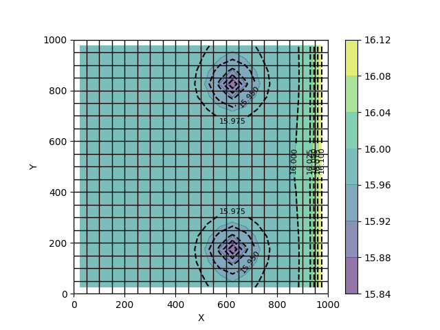

# Introduction

PyCOMUS is a Python interface built upon the COMUS model, capable of performing all the functions that the COMUS model offers.


# Documentation

[https://pycomus.readthedocs.io/en/latest/](https://pycomus.readthedocs.io/en/latest/)


# Installation

PyCOMUS requires **Python 3.0+** with:

```python
numpy
matplotlib
```

To install type:

```bash
pip install PyCOMUS(PyPI)
```


# Getting Started

```python
import numpy as np

import pycomus

if __name__ == "__main__":
    # MultiBoundMixedSim：

    # Create Model
    model = pycomus.ComusModel(model_name="MultiBoundMixedSim")

    # Control Params
    controlParams = pycomus.ComusConPars(model=model, intblkm=2, max_iter=10000, r_close=0.0001)

    # Output Params
    outParams = pycomus.ComusOutputPars(model)

    # Create Grid And Layer
    num_lyr = 2
    num_row = 20
    num_col = 20
    modelDis = pycomus.ComusDisLpf(model, num_lyr=num_lyr, num_row=num_row, num_col=num_col, row_space=50, col_space=50,
                                   lyr_type=[1 for _ in range(num_lyr)], lyr_cbd=[1, 0], y_coord=1000)

    # Grid Attribute
    bot = np.zeros((num_lyr, num_row, num_col))
    bot[0, :, :] = 10
    vkcb = np.zeros((num_lyr, num_row, num_col))
    vkcb[0, :, :] = 0.001
    tkcb = np.zeros((num_lyr, num_row, num_col))
    tkcb[0, :, :] = 0.1
    modelGridPar = pycomus.ComusGridPars(model, top=20, bot=bot, ibound=1, kx=10, ky=10, kz=5, vkcb=vkcb, tkcb=tkcb,
                                         shead=16, sc1=0.0001, sc2=0.08)

    # Set Period
    period = pycomus.ComusPeriod(model, [(10, 10, 1) for _ in range(2)])

    # Set SHB
    shead_period1 = np.zeros((num_lyr, num_row, num_col))
    shead_period1[0, :, 19] = 16
    shead_period2 = np.zeros((num_lyr, num_row, num_col))
    shead_period2[0, :, 19] = 17

    ehead_period1 = np.zeros((num_lyr, num_row, num_col))
    ehead_period1[0, :, 19] = 17
    ehead_period2 = np.zeros((num_lyr, num_row, num_col))
    ehead_period2[0, :, 19] = 18
    shbPackage = pycomus.ComusShb(model, shead={0: shead_period1, 1: shead_period2},
                                  ehead={0: ehead_period1, 1: ehead_period2})

    # Set WEL
    wellr_period1 = np.zeros((num_lyr, num_row, num_col))
    wellr_period1[1, 3, 12] = -500
    wellr_period1[1, 16, 12] = -500
    wellr_period2 = np.zeros((num_lyr, num_row, num_col))
    wellr_period2[1, 3, 12] = -300
    wellr_period2[1, 16, 12] = -300
    satthr_period1 = np.zeros((num_lyr, num_row, num_col))
    satthr_period1[1, 3, 12] = 0.1
    satthr_period1[1, 16, 12] = 0.1
    welPackage = pycomus.ComusWel(model, wellr={0: wellr_period1, 1: wellr_period2},
                                  satthr={0: satthr_period1, 1: satthr_period1})

    # Set EVT
    etSurf = np.zeros((num_lyr, num_row, num_col))
    etSurf[0, :, :] = 20
    etRate = np.zeros((num_lyr, num_row, num_col))
    etRate[0, :, :] = 0.002
    etMxd = np.zeros((num_lyr, num_row, num_col))
    etMxd[0, :, :] = 5
    etExp = np.zeros((num_lyr, num_row, num_col))
    etExp[0, :, :] = 2
    evtPackage = pycomus.ComusEvt(model, et_surf={0: etSurf, 1: etSurf}, et_rate={0: etRate, 1: etRate},
                                  et_mxd={0: etMxd, 1: etMxd}, et_exp={0: etExp, 1: etExp}, num_seg=2)

    # Set RIV
    cond = np.zeros((num_lyr, num_row, num_col))
    cond[0, :, 0] = 100
    rivBtm = np.zeros((num_lyr, num_row, num_col))
    rivBtm[0, :, 0] = 15
    shead_ehead_period1 = np.zeros((num_lyr, num_row, num_col))
    shead_ehead_period1[0, :, 0] = 16
    shead_ehead_period2 = np.zeros((num_lyr, num_row, num_col))
    shead_ehead_period2[0, :, 0] = 18
    rivPackage = pycomus.ComusRiv(model, cond={0: cond, 1: cond},
                                  shead={0: shead_ehead_period1, 1: shead_ehead_period2},
                                  ehead={0: shead_ehead_period1, 1: shead_ehead_period2},
                                  riv_btm={0: rivBtm, 1: rivBtm})

    # Write Output
    model.write_files()

    # Run Model
    model.run()

    # Data Extract
    data = pycomus.ComusData(model)
    head = data.read_cell_head(tar_period=0, tar_iter=0, tar_layer=0)
    map = pycomus.ComusPlot(model)
    map.plot_grid()
    map.plot_contour(head, contourf_kwargs={'cmap': 'viridis', 'alpha': 0.6},
                     colorbar_kwargs={'orientation': 'vertical'},
                     contour_kwargs={'colors': 'black', 'linestyles': 'dashed','levels':10},
                     clabel_kwargs={'inline': True, 'fontsize': 8})
    map.show_plot()

```


